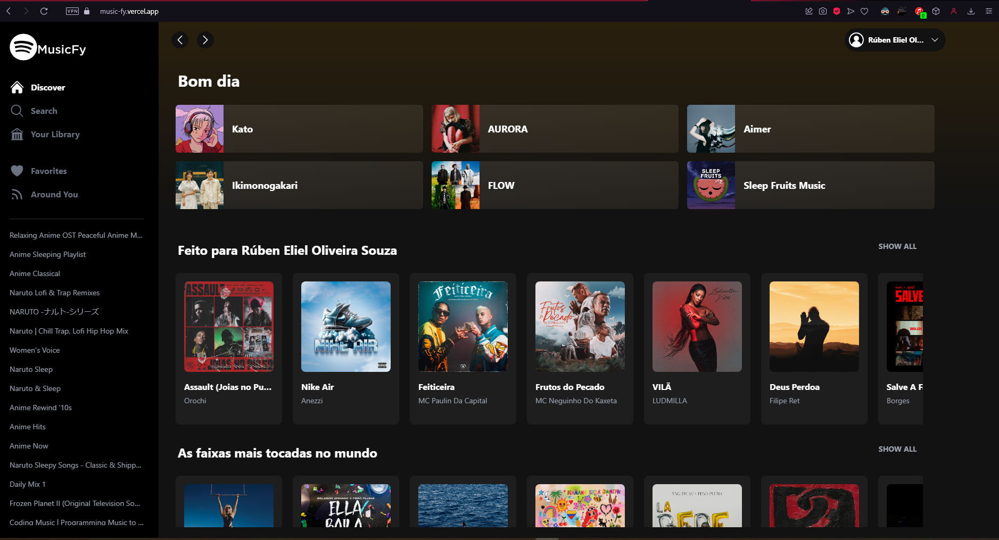

# 💻 MUSIC FY

<p>     O objetivo deste projeto é criar um clone da interface do usuário do Spotify, com as funcionalidades de reprodução de músicas, playlists e busca de músicas. Para isso, foram utilizadas as bibliotecas React e Redux, que proporcionam um desenvolvimento estruturado e organizado, além do Tailwind CSS, uma biblioteca de estilos que ajuda a criar interfaces modernas e responsivas.

O projeto faz uso da API pública do Spotify para buscar as informações das músicas e playlists e, utilizando o React e o Redux, criar uma interface que replica a do Spotify original assim como suas funcionalidades.

</p>

<h4 align="center">
	🚧  React JS  🚀 Em desenvolvimento...  🚧
</h4>

---

## 🎨 Preview

<p>
    A api do Spotify exige que os usuários que vão fazer parte do teste da aplicação tenham seus emails registrados no painel de administrador da API.
    No Entanto, se você deseja testar o deploy do projeto sinta-se a vontade para utilizar a conta abaixo.
</p>

        Email: programadordetestes@gmail.com
        Senha: testes1234

<h4 align="center"> 🚧 ABRA EM GUIA ANÔNIMA 🚧 </h4>

<p>Se o projeto não for aberto em guia anônima vai utilizar a sessão atual do Spotify em seu navegador que não está registrada no console</p>

### [](https://music-fy.vercel.app)

<p>
Se você tentou acessar o projeto com o email acima e por algum motivo não funcionou, você terá que rodar o projeto localmente seguindo os passos descritos logo abaixo.
</p>

---

## 🛠 Bibliotecas e Tecnologias

- React
- Vite
- Javascript
- Redux
- JSX
- Tailwind CSS
- Yarn - Package Manager
- Fetch
- Axios
- Hero Icons
- React Icons
- React Loading
- React Router Dom
- Color Thief
- Swiper

---

## 📦Pré-requisitos

Antes de iniciar o desenvolvimento, é necessário ter as seguintes ferramentas instaladas:

- Node.js
- NPM ou Yarn
- VSCode ou editor de códigos de sua preferência

---

## 🔥Configuração da Api do Spotify

Para utilizar a Api do Spotify no projeto, é necessário registrar uma conta no <a href="https://developer.spotify.com/dashboard">Spotify for Developers</a> criar um projeto e configurá-lo de acordo com as necessidades do projeto. Acesse a guia Settings do seu projeto, vamos precisar do Client ID e Client Secret e também adicionar o http://localhost:3000/ na guia "Redirect URIs".

---

## 🚀 Como executar o projeto

```bash

# Clone este repositório
$ git clone https://github.com/RubenSouza/MusicFy.git

# Acesse a pasta do projeto no seu terminal/cmd
$ cd MusicFy
# Instale as dependências
$ npm install || $ yarn install
```

---

## 🔒 Variáveis Locais

Após clonar o projeto, navegue até o arquivo env.example, renomeie para .env.local e adicione as chaves que você conseguiu do Spotify for Developers nos passos anteriores. Após isso você já está pronto para executar o projeto localmente. Lembre-se de utilizar a mesma conta Spotify que utilizou para se registrar no Spotify for Developers para utilizar o app, ou adicione uma nova conta na guia de usuários de sua aplicação.

<br>

```bash
# Execute a aplicação em modo de desenvolvimento

$ npm run dev || $ yarn dev

# A aplicação será aberta na porta:3000 - acesse http://localhost:3000
```

---

## 🦸 Autor

<a href="https://my-portfolio-rubensouza.vercel.app">
 
 <br />
 <sub><b>Rúben Eliel</b></sub></a> <a href="https://my-portfolio-rubensouza.vercel.app">🚀</a>

Feito com ❤️ por Rúben Eliel 👋🏽 Entre em contato!

[](https://www.linkedin.com/in/rúben-eliel-oliveira-souza-272b68159/)
[](mailto:rubem.eliel2012@gmail.com)

---

## 📝 Licença

Este projeto esta sobe a licença [MIT](./LICENSE).

Feito com ❤️ por Rúben Eliel 👋🏽 [Entre em contato!](https://www.linkedin.com/in/rúben-eliel-oliveira-souza-272b68159/)

---
